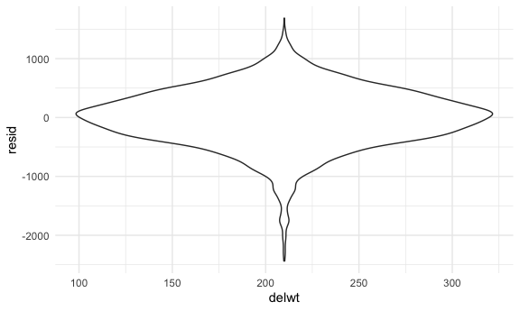
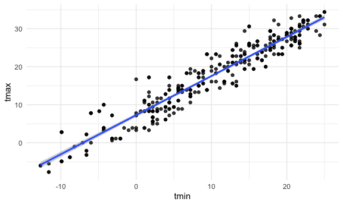

p8105\_hw6\_yl4928
================
Rachel
12/1/2021

## Problem 1

\#1.1 Load and clean the data

``` r
birthweight_raw = 
  read_csv("./birthweight.csv")
```

``` r
birthweight_df = 
  birthweight_raw %>% 
  mutate(
    babysex = factor(recode(babysex, `1` = "male", `2` = "female")),
    frace = factor(recode(frace, `1` = "White", `2` = "Black", `3` = "Asian", `4` = "Puerto Rican", `8` = "Other", `9` = "Unknown")), 
    mrace = factor(recode(mrace, `1` = "White", `2` = "Black", `3` = "Asian", `4` = "Puerto Rican", `8` = "Other"))
  )
```

\#1.2 Check missing values

\#1.3 Regreession model

``` r
model1 = lm(bwt ~ delwt, data = birthweight_df)
```

``` r
model1_df = birthweight_df %>% 
  select(bwt, delwt) %>% 
  modelr::add_residuals(model1) %>% 
  modelr::add_predictions(model1)

model1_df %>% 
  ggplot(aes(x = delwt, y = resid)) + geom_violin()
```


\#1.3.1 Compare model to two others (One using length at birth and
gestational age as predictors (main effects only); One using head
circumference, length, sex, and all interactions (including the
three-way interaction) between these)

``` r
birthweight_cv_df = 
  crossv_mc(birthweight_df, 100) %>% 
  mutate(
    train = map(train, as_tibble), 
    test = map(test, as_tibble)
  ) %>% 
  
  mutate(
    model1 = map(train, ~lm(bwt ~ delwt, data = .x)),
    model2 = map(train, ~lm(bwt ~ blength + gaweeks, data = .x)),
    model3 = map(train, ~lm(bwt ~ bhead + blength + babysex + bhead*blength + bhead*babysex + blength*babysex + bhead*blength*babysex, data = .x))) %>% 
  
  mutate(
    rmse_model1 = map2_dbl(model1, test, ~rmse(model = .x, data = .y)), 
    rmse_model2 = map2_dbl(model2, test, ~rmse(model = .x, data = .y)), 
    rmse_model3 = map2_dbl(model3, test, ~rmse(model = .x, data = .y))
  )
```

…The output

``` r
birthweight_cv_df %>% 
  select(starts_with("rmse")) %>% 
  pivot_longer(
    everything(), 
    names_to = "model",
    values_to = "rmse",
    names_prefix = "rmse_"
  ) %>% 
  ggplot(aes(x = model, y = rmse)) + geom_boxplot()
```


Comparing to other two models, `Model3` is the best model.

## Problem 2

# Load the data

``` r
weather_df = 
  rnoaa::meteo_pull_monitors(
    c("USW00094728"),
    var = c("PRCP", "TMIN", "TMAX"), 
    date_min = "2017-01-01",
    date_max = "2017-12-31") %>%
  mutate(
    name = recode(id, USW00094728 = "CentralPark_NY"),
    tmin = tmin / 10,
    tmax = tmax / 10) %>%
  select(name, id, everything())
```

\#Bootstrapping

``` r
boot_sample = function(df) {
  sample_frac(df, replace = TRUE)
}
```

``` r
boot_sample(weather_df) %>% 
  ggplot(aes(x = tmin, y = tmax)) + 
  geom_point(alpha = .8) + 
  stat_smooth(method = "lm")
```



``` r
bootstrapping = 
  tibble(
    strap_number = 1:5000,
    strap_sample = rerun(5000, boot_sample(weather_df))
  )
```

``` r
bootstrap_results_r = 
  bootstrapping %>% 
  mutate(
    models = map(strap_sample, ~lm(tmax~tmin, data = .x)), 
    results1 = map(models, broom::glance)
  ) %>%
  select(-strap_sample, -models) %>% 
  unnest(results1)

bootstrap_results_r %>% 
  ggplot(aes(x = r.squared)) + geom_density()
```


The distribution is approximately normal, however, it has a heavy tail
extending to low values, features that may be related to the frequency
with large outliers are included in the bootstrap sample.

``` r
bootstrap_results_beta = 
  bootstrapping %>% 
  mutate(
    models = map(strap_sample, ~lm(tmax ~ tmin, data = .x)),
    results2 = map(models, broom::tidy)
  ) %>% 
  select(-strap_sample, -models) %>% 
  unnest(results2)

bootstrap_results_log = 
  bootstrap_results_beta %>% 
  select(strap_number, term, estimate) %>% 
  pivot_wider(
    names_from = term, 
    values_from = estimate
  ) %>% 
  mutate(log = log(`(Intercept)`*`tmin`))


ggplot(bootstrap_results_log, aes(x = log)) + geom_density()
```


The distribution is also approximately normal, a little tail extending
to lower values, which indicates tehre might be large outliers included.

\#Confidence interval

``` r
bootstrap_results_r %>% 
  summarise(
    ci_lower = quantile(r.squared, 0.025),
    ci_upper = quantile(r.squared, 0.975)
  ) %>% 
  knitr::kable()
```

| ci\_lower | ci\_upper |
|----------:|----------:|
| 0.8938429 | 0.9277504 |

``` r
bootstrap_results_log %>% 
  summarise(
    ci_lower = quantile(log, 0.025), 
    ci_upper = quantile(log, 0.975)
  ) %>% 
  knitr::kable()
```

| ci\_lower | ci\_upper |
|----------:|----------:|
|  1.964595 |  2.058463 |
